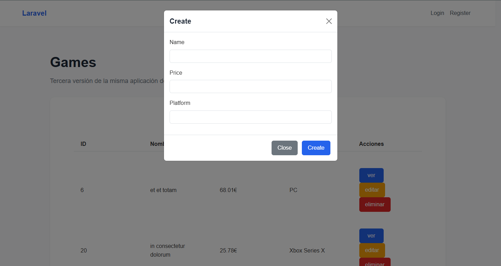

# Laravel Games Application with Fetch API
A modern web application for managing video games built with Laravel and JavaScript Fetch API. The application provides CRUD operations with a responsive interface and real-time updates without page reloads.

## Features

- 🎮 Game Management (CRUD operations)
- 🔐 User Authentication (Login/Register)
- 📱 Responsive Design
- ⚡ Real-time Updates using Fetch API
- 📝 Form Validation
- 🎨 Bootstrap 5 Styling

## Screenshots

### Main Games List

*Main interface showing the list of games with actions*

### Create Game

*Modal form for adding new games*

### Edit Game

*Modal form for editing existing games*

### Delete Confirmation

*Confirmation modal before deleting a game*

## Technical Implementation

### Frontend
- Modern JavaScript (ES6+)
- Fetch API for AJAX requests
- Bootstrap 5 for UI components
- Responsive design
- Modal dialogs for actions

### Backend
- Laravel 11 framework
- SQLite database
- RESTful API endpoints
- Form validation
- Authentication system

## API Endpoints

- `GET /game` - List all games (paginated)
- `POST /game` - Create a new game
- `GET /game/{id}` - View game details
- `PUT /game/{id}` - Update a game
- `DELETE /game/{id}` - Delete a game
- `POST /login` - User login
- `POST /register` - User registration
- `POST /logout` - User logout

## Installation

1. Clone the repository
    ```bash
    git clone https://github.com/yourusername/laravel-games-app.git
    ```

2. Navigate to the project directory
    ```bash
    cd laravel-games-app
    ```

3. Install PHP dependencies
    ```bash
    composer install
    ```

4. Install JavaScript dependencies
    ```bash
    npm install
    ```

5. Copy the example environment file and configure the environment variables
    ```bash
    cp .env.example .env
    ```

6. Generate the application key
    ```bash
    php artisan key:generate
    ```

7. Run the database migrations
    ```bash
    php artisan migrate
    ```

8. Start the development server
    ```bash
    php artisan serve
    ```

9. Open your browser and visit `http://localhost:8000`